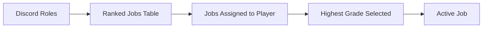
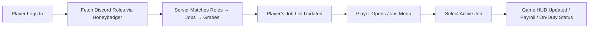

# QBX Badger Bridge

[](LICENSE)
[]()

QBX Badger Bridge synchronizes Discord roles with QBX jobs in GTA V roleplay servers. It supports multiple character systems and modular notifications.

---

## Table of Contents

- [Features](#features)
- [Requirements](#dependencies)
- [Installation](#installation)
- [Configuration](#configuration)
- [Commands](#commands)
- [Notifications](#notifications)
- [Debugging](#debug-output-example)
- [How It Works](#how-it-works)
- [Credits](#credits)
- [License](#license)

---

##  Features

*  Automatic job synchronization when a player joins (QBX or CRM Multicharacter supported)
*  Manual job sync command for admins and developers
*  In-game job menu with ox_lib context menu
*  Multi-job support — players can hold multiple jobs
*  Discord role-based job assignment via Honeybadger
*  Automatic save delay to prevent race conditions
*  Developer-friendly debug logging system
*  Modular notification support (`crm-hud`, `ox_lib`, or debug print)
* Active job system with on-duty highlighting

---

## ⚙️ Dependencies

| Dependency                          | Description                  | Link                                                 |
| ----------------------------------- | ---------------------------- | ---------------------------------------------------- |
| **Qbox Core**                       | Core framework               | [qbx_core](https://github.com/Qbox-project/qbx_core) |
| **Honeybadger**                     | Discord role bridge          | —                                                    |
| **ox_lib**                          | Context menu & notifications | [ox_lib](https://github.com/overextended/ox_lib)     |
| **crm-hud** *(optional)*            | Notifications system         | —                                                    |
| **crm-multicharacter** *(optional)* | Character loading event      | —                                                    |

---

## Configuration

### `config.lua`

```lua
Config = {}

Config.Debug = true
Config.Notifications = 'crm-hud'
Config.Multicharacter = 'qbx_core'

Config.Commands = {
    syncJobs = 'syncjobs',
    resyncAll = 'resyncall',
    jobs = 'jobs',
}

Config.SaveDelay = 1000
Config.AdminPermissions = {
    'qbx_badger_bridge.admin',
}
```

---

## Ranked Jobs Example (`ranked_jobs.lua`)

```lua
RankedJobs = {
    { roleName = "K9 Coordinator", job = "k9", grade = 3 },
    { roleName = "K9 Supervisor", job = "k9", grade = 2 },
    { roleName = "K9 Certified", job = "k9", grade = 1 },
    { roleName = "K9 Trainee", job = "k9", grade = 0 },

    { roleName = "Department of Public Safety", job = "dps", grade = 1 },
    { roleName = "SADOT", job = "sadot", grade = 0 },
}
```

---

## Commands

| Command      | Description                         | Permission           |
| ------------ | ----------------------------------- | -------------------- |
| `/jobs`      | Opens ox_lib job selection menu     | All players          |
| `/syncjobs`  | Manually syncs Discord roles → jobs | Debug only           |
| `/resyncall` | Resync all players’ jobs            | Console / Admin only |

---

## How It Works

### Flow Overview




### Quick Setup Diagram



### Explanation

1. **Discord Role Fetching**: Honeybadger retrieves the player’s verified Discord roles.
2. **Role Matching**: The server script cross-references these roles against `ranked_jobs.lua`.
3. **Job Assignment**: Each matched role is assigned as a job to the player with the corresponding grade.
4. **Highest Grade Priority**: If multiple roles map to the same job, the **highest grade** is applied.
5. **Job Removal**: If a role is removed from Discord, the corresponding job is removed.
6. **Active Job Selection**: Players can open `/jobs` to select their active job.
7. **In-Game Effects**: The active job is reflected in payroll, HUD notifications, and on-duty features.

---

## Notifications

* **crm-hud** → Uses custom CRM notification popups
* **ox_lib** → Uses ox_lib’s built-in notify
* **none** → No notifications (debug only)

---

## Debug Output Example

```
[qbx_badger_bridge][DEBUG] Starting job sync for John Doe (1). Manual trigger: false
[qbx_badger_bridge][DEBUG] Discord roles for source 1: SADOT, K9 Certified, DPS Chief of Support Services
[qbx_badger_bridge][DEBUG] Added/Updated job k9 to grade 1 for 1
[qbx_badger_bridge][DEBUG] Added/Updated job sadot to grade 0 for 1
[qbx_badger_bridge][DEBUG] Player data saved for source 1.
```

---

## Notes

* Players can hold multiple jobs at once.
* The **highest matching grade** from their Discord roles is always applied.
* Automatic sync triggers on player load for supported multicharacter systems.
* Configurable save delay prevents premature overwrites during load.

---

## Credits

* Developed by **Venado**
* Based on **Qbox Framework**
* Integrated with **Honeybadger Discord Role Sync**
* Notifications via **ox_lib** and **crm-hud**

---

## License

This project is licensed under the MIT License.
See `LICENSE` for more information.
